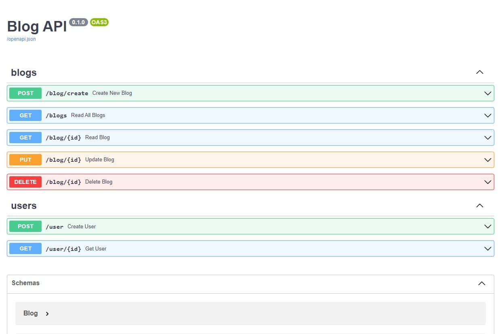

# Blog API system with FastAPI

### Overview 
Learning FastAPI with [Offical Docs](https://fastapi.tiangolo.com/tutorial/). 
Developing Blog API system to understand development process of FastAPI projects

### Topics and Development Process
- Installation and Setup FastAPI
- Terminology of FastAPI (operation, path, decorator, function)
- Path and Query Parameters and Validation
- Pydantic models, schemas
- POST operation and Request body

---

- FastAPI Database connection
- [SQL (Relational) Databases](https://fastapi.tiangolo.com/tutorial/sql-databases/)
- [SQL Alchemy](https://www.sqlalchemy.org/)
- Creating Database models and schemas
- Storing data to the Database
- Getting data from the Database
- Deleting data from the Database
- CRUD functionalities 

---

- Response status codes
- HttpExceptions
- Response models and pydantic schemas
- Pydantic [offical docs](https://pydantic-docs.helpmanual.io/)

---

- Creating a User model
- Hashing the password 
- Metadata and Docs URLs

### Dependencies
- python (3.6 or greater)

### Setup
    $ python -m venv venv
    $ source venv/bin/activate
    $ pip install -r requirements.txt
    
    # Windows OS:
    > python -m venv venv
    > venv\Scripts\activate.bat
    > pip install -r requirements.txt

### Run 
    $ uvicorn main:app --reload

### Docs

