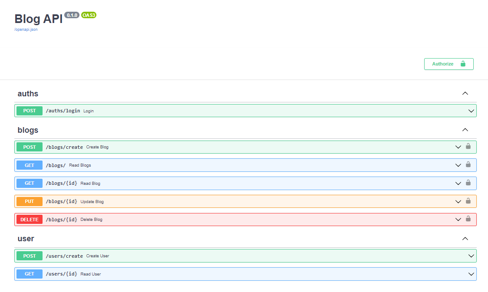
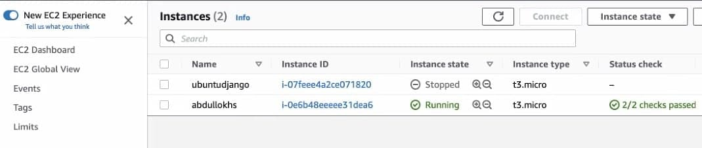
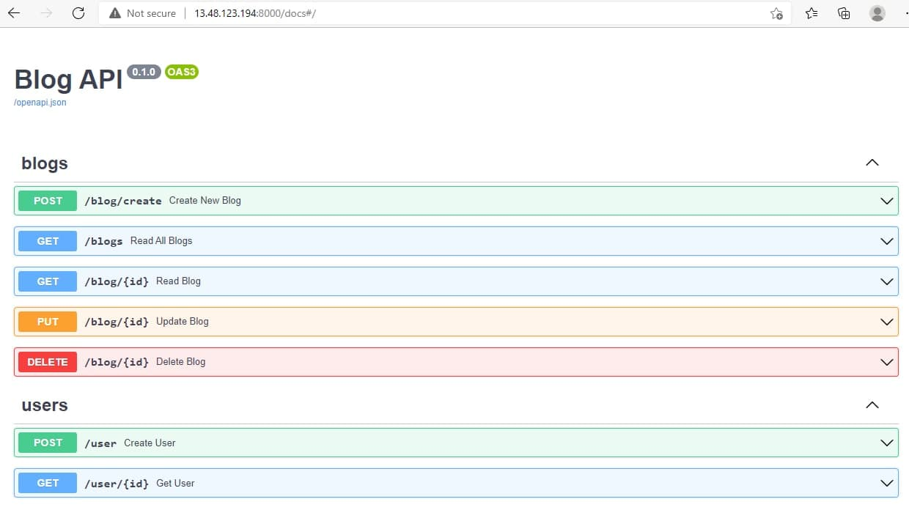

# Blog API system with FastAPI

### Overview 
Learning FastAPI with [Offical Docs](https://fastapi.tiangolo.com/tutorial/). 
Developing Blog API system to understand development process of FastAPI projects

### [Topics and Development Process](https://github.com/Alimov-8/fastapi-blog-project/blob/fastapi-graphql/topics_and_development.md)
- Commits list and roadmap
- Learnings materials and plans

### Dependencies
- python (3.6 or greater)

### Setup with Virtualenv
    $ python -m venv venv
    $ source venv/bin/activate
    $ pip install -r requirements.txt
    
    # Windows OS:
    > python -m venv venv
    > venv\Scripts\activate.bat
    > pip install -r requirements.txt

### Run 
    $ uvicorn main:app --reload

### Running FastAPI app with Docker
    # Start docker compose 
    $ docker-compose up
    # Check 127.0.0.1/docs from browser
    
    # Stop docker compose
    $ docker-compose down

### Docs

.

### Deploy FastAPI App to AWS EC2
    // Prepare the EC2 with Python and Apache server
    $ sudo apt upgrade
    $ sudo apt install apache2  # /var/www/html/index.html
    $ sudo service apache2 start
    $ sudo apt install python3-pip
    $ sudo apt install python3-venv
    
    // Cloning Project and Install Dependencies
    $ git clone [project link] && cd [project]
    $ python3 -m venv env
    $ source env/bin/activate
    $ pip install -r requirements.txt
    
    // Runing app
    $ uvicorn main:app --reload  # Run from main.py folder
    

